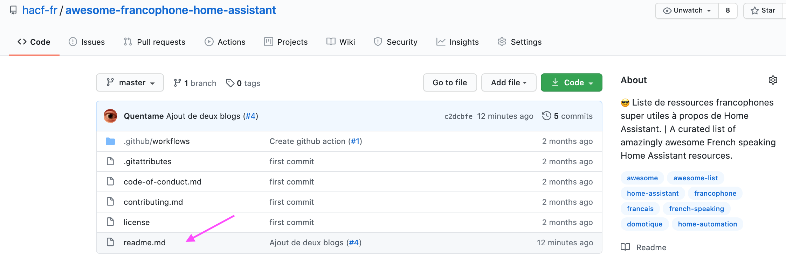
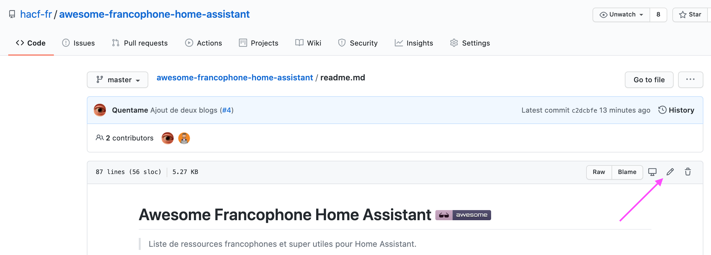
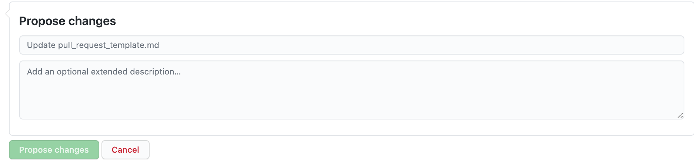

################ A MODIFIER ###################################
Veuillez noter que ce projet est liée à un [code de conduite des contributeurs](code-of-conduct.md).
En participant à ce projet vous acceptez de respecter ses termes.
#################################################################
## Modèle pour un lien dans la liste

Utilisez le modèle : `[Nom_du_lien](url_du_lien) - Descriptif du lien.`

## Comment contribuer à la liste

Cette liste est ouverte à tous. Y contribuer est simple: vous avez besoin uniquement d'un compte [GitHub](https://github.com/).

Voici un guide pas à pas pour contribuer à cette liste:

1. Rendez vous sur le [dépôt de la liste](https://github.com/hacf-fr/awesome-francophone-home-assistant) sur GitHub
2. Cliquez sur le fichier `README.md`: 
3. Cliquez sur le bouton `edit`: 
4. Vous pouvez éditer le contenu du fichier dans votre navigateur. Assurez vous de suivre les bonnes pratiques ci-dessus. Le fichier utilise le language GitHub Flavored Markdown avec une ([introduction pour les débutant](https://learnxinyminutes.com/docs/fr-fr/markdown-fr/) et la [spécification détaillée pour un usage expert](https://github.github.com/gfm/).
5. Indiquez dans le formulaire de bas de page pourquoi vous proposez ces changements et cliquez sur "Propose file change": 
6. Envoyez votre Pull Request.
7. Attendez une relecture et répondez aux éventuelles demandes de modification.
8. Votre contribution est fusionnée si elle répond à toutes les exigences du projet.

Merci pour votre contribution.

## Pour tester la génération du site statique
 ######################## A MODIFIER #####################################################################
Cette Awesome list est utilisée pour générer un site web statique à l'aide de [Mkdocs](https://www.mkdocs.org/).
Pour tester en local la génération vous avez besoin d'installer [nox](https://nox.thea.codes/en/stable/)
au préalable.
Ensuite nox s'occupe d'installer toutes les dépendances nécessaires
dans un environnement virtuel:

`$ nox -s docs`

Cette commande a deux comportements:

- En mode interactif (typiquement quand vous lancez la commande dans votre terminal),
  elle génère le contenu du site statique
  et lance un serveur pour le consulter à l'aide de son navigateur en consultant l'URL `http://127.0.0.1:8000/`
- En mode non-interactif (dans un script de _Continuous Integration_ par exemple),
  elle génère le contenu du site statique dans le répertoire `site`.
